<!---

--->

      
      

<!---
Richard5678/Richard5678 is a ✨ special ✨ repository because its `README.md` (this file) appears on your GitHub profile.
You can click the Preview link to take a look at your changes.
--->
